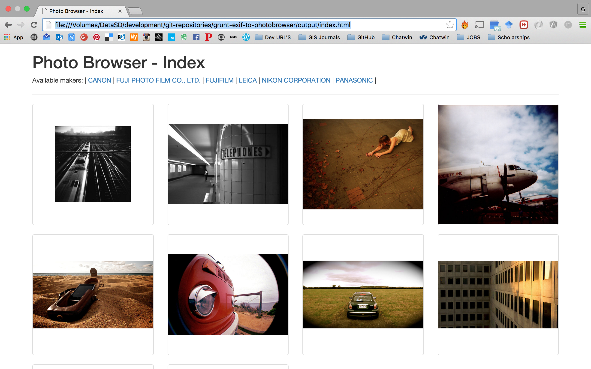
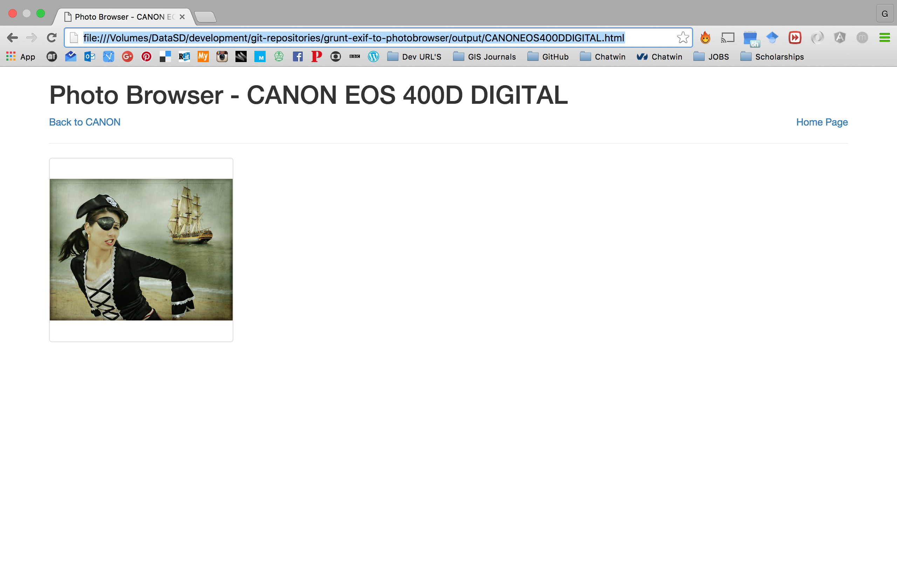

[](https://travis-ci.org/Kalimaha/grunt-exif-to-photobrowser)

# Photo Browser
Generate a simple HTML browser for pictures listed in a given EXIF file.

## Prerequisites
This project has been developed with [Node.js](https://nodejs.org/en/) and [Grunt](http://gruntjs.com/). To install Node.js please refer to its [download page](https://nodejs.org/en/download/). To install Grunt please refer to the [getting started page](http://gruntjs.com/getting-started).

## Installation
To install this project, please move to the root directory and from the command line execute:

````
npm install
````

This command will download all the project's dependencies.

## Run
The project requires two parameters to run: ```input_file``` and ```output_folder```. The first parameter is the filepath to the XML file containing the works. The latter is the output directory where the Photo Browser HTML files will be stores. These parameters must be passed to the Grunt task runner, from the project's root directory, as per the example below:

```
grunt --input_file=/home/kalimaha/Desktop/works.xml --output_folder=/tmp
```
The execution will produce an output similar to the following:
```
Running "exif_to_photobrowser:custom_options" (exif_to_photobrowser) task
Store the content of the file into an XML string...
Convert the XML string to a JSON object...
Create an array of works...
Re-organize the original content in a tree...
Create HTML for the index page...
	Generate HTML for: CANON
		Generate HTML for: CANON EOS 20D
		Generate HTML for: CANON EOS 400D DIGITAL
	Generate HTML for: FUJI PHOTO FILM CO., LTD.
		Generate HTML for: SLP1000SE
	Generate HTML for: FUJIFILM
		Generate HTML for: FINEPIX S6500FD
	Generate HTML for: LEICA
		Generate HTML for: D-LUX 3
	Generate HTML for: NIKON CORPORATION
		Generate HTML for: NIKON D80
	Generate HTML for: PANASONIC
		Generate HTML for: DMC-FZ30
DONE. You can browse the works at: /tmp/index.html
```

## Tests
To run the tests, please run the following command from the project's root:
```
grunt test
```
The execution will produce an output similar to the following:
```
Running "nodeunit:tests" (nodeunit) task
Testing array2archive_test.js.OK
Testing create_html_file_test.js..OK
Testing create_index_page_test.js.OK
Testing create_maker_id_test.js.OK
Testing create_maker_pages_test.js.OK
Testing create_model_pages_test.js.OK
Testing get_makers_test.js.OK
Testing get_models_test.js.OK
Testing get_works_test.js.OK
Testing object2array_test.js.OK
Testing string2object_test.js.OK
Testing xml2string_test.js...OK
>> 31 assertions passed (940ms)
```

## Continuous Integration
The project is under continuous integration on [TravisCI](https://travis-ci.org/) and it is available at [this link](https://travis-ci.org/Kalimaha/grunt-exif-to-photobrowser).

## Sample Output
|Index|Maker|Model|
|-----|-----|-----|
||||
