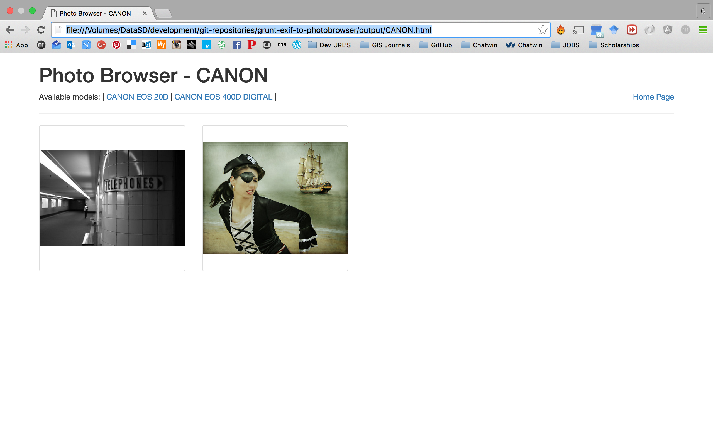

# Photo Browser

Generate a simple HTML browser for pictures listed in a given EXIF file.

## Prerequisites

## Installation

## Run

## Tests

## Sample Output
|Index|Maker|Model|
|-----|-----|-----|
||||